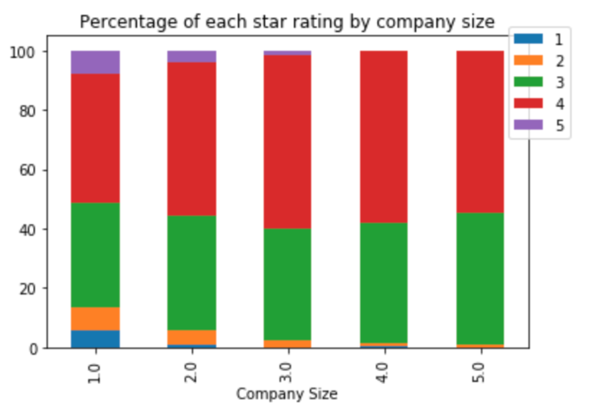

<h1 id="toc_0">Diversity and Inclusion</h1>

<h2 id="toc_1">Overview</h2>

Conversations and ideas surrounding inclusivity, equity, and diversity have been increasingly present regarding demographics defined by race and ethnicity, gender identity, sexual orientation, socio-economic status, disability status, parental status, and more. According to a recent study done by Glassdoor.com, &quot;About 1 in 3 employees and job seekers (32%) would not apply to a job at a company where there is a lack of diversity among its workforce.&quot;

In response to a summer of unrest surrounding racial injustice in 2020, and companies promising the public to &quot;do better,&quot;  Glassdoor has added a fairly new metric by which employees may rate companies they have worked for at present and in the past. The new &quot;Diversity &amp; Inclusion Rating&quot; is one small way that people can hold companies accountable to this promise.

The question to the consumer then becomes &quot;how can we determine if a company is actually inclusive?&quot; This project seeks to identify diversity and inclusion ratings using natural language processing based on a company&#39;s mission statement.

<h2 id="toc_2">Approach</h2>

<h3 id="toc_3">Gather Data</h3>

Glassdoor.com is a popular website built on the foundation of increasing workplace transparency. Users can rate companies on a scale of 1 to 5 on categories like Culture &amp; Values, Work/Life Balance, Compensation, and others.

This project begins with web scraping over 2,500 company urls from a root url: <a href="https://www.glassdoor.com/Explore/browse-companies.htm?overall_rating_low=0&amp;page=1&amp;isHiringSurge=0">glassdoor.com</a>, functions which may be found in the <code>web_scrapers</code> folder. Variables from each company scraped include name, size, headquarters location, industry, ratings (overall, diveristy &amp; inclusion, and others), number of reviews, description, and mission statement.

As the rating system is on a scale from 1 to 5, the target variable is defined as whether a company&#39;s diversity and inclusion rating falls above or below 4.0 (indicating an &quot;A&quot; rating on this scale). After data was cleaned by removing companies with fewer than 100 reviews, or those without description and/or mission statements, approximately 46% or companies in the dataset are considered to be inclusive by this metric.

<h3 id="toc_4">Exploratory Data Analysis</h3>

Several layers of EDA were performed in order to find any immediate trends. One such layer was grouping the diversity and inclusion star rating by company size. The below plot indicates that larger companies tend to have a higher proportion of high ratings, while companies inder 500 employees show lower ratings more prevalently.

Another layer was performed on ratings by headquarter location using state. We see that on some states on the plot where you see a higher rate of companies that are note more inclusive or less so. For example, our best performing state is California, whereas unfortunately Georgia seems to be falling behind.

These initial EDA findings indicate they may help a model predict on our target variable.

<h3 id="toc_5">Modeling and Evaluation</h3>

There were several models implemented in order to find the best performance. Metrics used in this study was primarily accuracy. As this project is an answer for job-seekers wishing to avoid non-inclusive companies, we want to identify and flag as many non-inclusive companies as possible, and so taking a look at a confusion matrix plot provides further insight. 

<h3 id="toc_6">Models Tested:</h3>

<ul>
<li>Random Forest Classifier (baseline)</li>
<li>Random Forest with GridSearch</li>
<li>Logistic Regression</li>
<li>Naive Bayes</li>
</ul>

The best performing model was the Logistic Regression model with an accuracy score of 59.38% (15% above the null accuracy), and an F-1 score of 68.47%. The model was able to successfully identify 15% of non-inclusive companies (79 companies). Unfortunately, almost 30% of non-inclusive companies are incorrectly identified as inclusive (149 companies).

<h2 id="toc_7">Findings</h2>

While numerous techniques were used to feature engineer and dive deeper into the data, ideal evaluation metrics were tough for this business problem. There are several factors which may contribute to our model&#39;s less-than-stellar performance. One being the timeframe involved. 

As previously mentioned, the diversity and Inclusion rating is a fairly new metric and only provides about 4 months of data as the date of this project. This means that many companies do not yet have enough votes in order to provide an accurate portrayal of their diversity.

Of course, we also have the question of user bias. Many people are still learning what equity is and what it means to be inclusive. As social movements like Black Lives Matter and Me Too (just to name a few) become more talked about in a workforce setting, I believe that more people will begin catching up.

<h2 id="toc_8">Recommendations Next Steps</h2>

<ul>
<li>Additional modeling techniques such as alternative vectorizing methods, clustering, etc.</li>
<li>Implementing Neural Networks such as LSTM, and/or Transformers such as BERT and ELMo</li>
<li>Incorporating additional metrics into the models such as company size, industry, and headquarters location,</li>
<li>To offset user bias, it may be necessary to use an alternative dataset for our inclusion metric. I recently discovered that Fortune.com has an ongoing list named <a href="https://fortune.com/best-workplaces-for-diversity/">&quot;The 100 Best Workplaces for Diversity&quot;</a>. According to their <a href="https://fortune.com/franchise-list-page/best-workplaces-diversity-methodology-2019/">methodology statement</a>, they &quot;analyze anonymous survey feedback representing more than 4.8 million US employees.&quot; I beleive this may be a good next place to look.</li>
<li>As with any machine learning business problem: More time, more data! As time goes on and more reviews come pouring in to glassdoor.com, I&#39;m looking forward to running these models again this time next year and in years to come.</li>
</ul>

<h2 id="toc_9">Repository Structure</h2>

<pre><code class="language-none">├── data                        CSV files
├── images                      images    
├── modeling                    pickled files saved for modeling
├── web_scrapers                functions used to webscrape
├── 1_Cleaning.ipynb            notebook for initial data cleaning
├── 2_NLP_Preprocessing.ipynb   notebook for pre-processing (includes baseline model)
├── 3_Modeling.ipynb            additional model testing
├── Clustering_test             test notebook
└── README.md                   ReadMe</code></pre>

